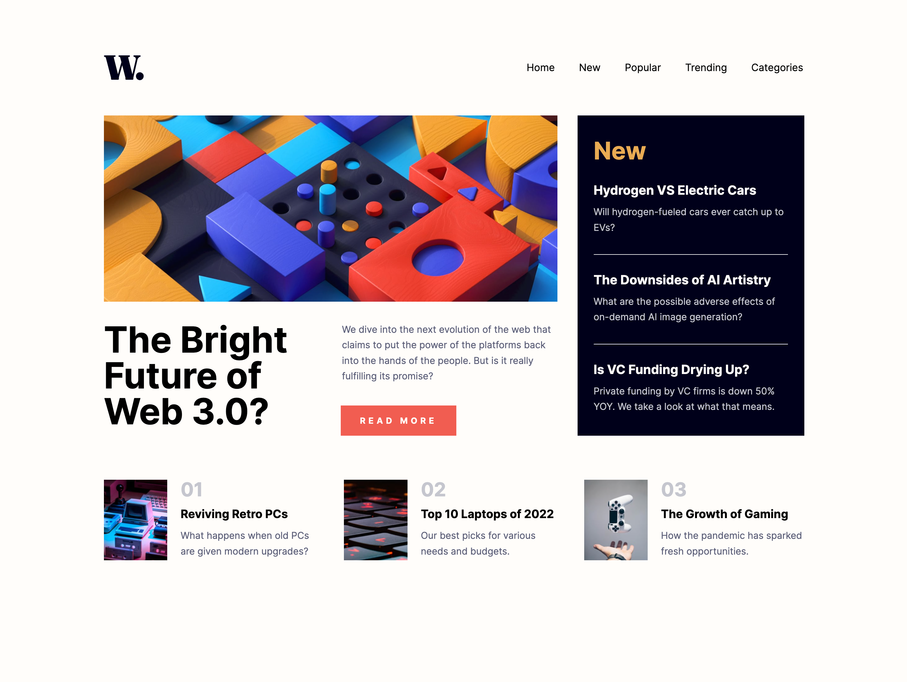

# Frontend Mentor - news-homepage-main

I coded this news homepage myself and the lay-out was designed by Fronted Mentor. Frontend Mentor provides challenges for frontend developers so they can make projects without the problem of designing the project. [See the challenge on Frontend Mentor.](https://www.frontendmentor.io/challenges/news-homepage-H6SWTa1MFl)

## The challenge

The challenge was to make a news-homepage as close to the design as possible. They provided a style-guide with the colors, font and screenshots of the design. Also and screenshot with active states was attached.

## Screenshots

## My experience

This challenge I learned a lot more about css grid. It is super useful and I would like to practice it even more. When I made the animation for closing the mobile menu it disappears with the background directly instead of waiting to slide the menu to the right en then disappearing the background. I set a set timeout in javascript and the problem was solved. Still don't know why the menu did disappear directly with the background.

### Links

- Solution URL: [github repository](https://github.com/Jolijn0101/news-homepage-main)
- Live Site URL: [github page](https://jolijn0101.github.io/news-homepage-main/)
